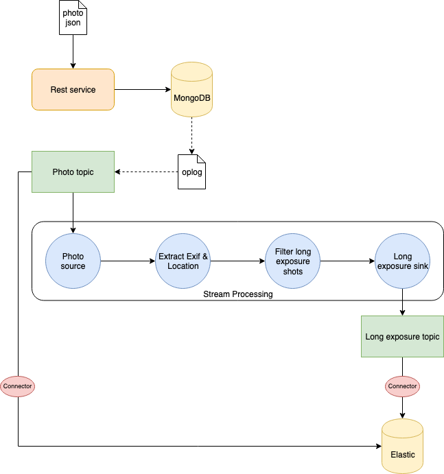

# Kafka Streams Playground
I developed this simple application to experiment with [Kafka Streams](https://kafka.apache.org/documentation/streams/). The objective has been to implement the [Change Data Capture](https://en.wikipedia.org/wiki/Change_data_capture) (CDC) pattern using [MongoDB](https://www.mongodb.com/), Kafka Streams, and [Elasticsearch](https://www.elastic.co/).

This `README` will briefly describe the usecase and how to run the project, for a more detailed tutorial wait for my article on [freeCodeCamp](https://www.freecodecamp.org/news)! :wink:

## Use Case
The use case is depicted in the following diagram.

Our web service is responsible of storing the information about photos posted by users. The information is provided in `JSON` format. Since I like to post my shots on [Unsplash](https://unsplash.com/), and the website provides free access to its API, I used their model for the photo information `JSON` document.

Once the `JSON` is sent through a `POST` request to our server, we store the document inside a MongoDB database.
Once the document is stored in MongoDB, we will store it also in Elasticsearch for quick indexing. However, we love long exposure shots, and we would like store in a separate index a subset of information regarding this kind of photos. It can be the exposure time, as well as the location (latitude and longitude) where the photo has been taken. In this way, we can for example create a map of locations where usually photographers take long exposure photos.

Here comes the interesting part: instead of explicitly call Elasticsearch in our code once the photo info is stored in MongoDB, we can implement a CDC pattern exploiting Kafka and Kafka Streams. We listen to modification to MongoDB oplog using the interface provided by MongoDB itself, and when the photo is stored we sent it to a `photo` Kafka topic. Using Kafka connect, an Elasticsearch sink is configured to save evertything sent to that topic to a specific index. In this way we can index all photos stored in MongoDB automatically.
We need to take care of the long exposure photos too. It requires some processing of the information to extract what we need. For this reason, we use Kafka Streams to create a processing topology to:
1. Read from the `photo` topic
2. Extract exif and location information
3. Filter long exposure photos (exposure time > 1 sec.)
4. Write to a `long-exposure` topic.
Then another Elasticsearch sink connector will read data from the `long-exposure` topic and write it to a specific index in Elasticsearch.

It is quite simple, but enough to have fun with the CDC pattern and Kafka Streams! :grin:

## How to run the project
This is quite easy: simply run the `setup.sh` script in the root folder of the repo!
What the script will do?
1. Run the `docker-compose` file with all the services.
2. Configure MongoDB replica set. This is required to enable the Change Stream interface to capture data changes. More info about this [here](https://docs.mongodb.com/manual/changeStreams/).
3. Configure the Kafka connectors.
4. Connect to the logs of the server.

The docker-compose will run the following services:
* Our server
* 3 instances of MongoDB (required for the replica set)
* Mongoku, a MongoDB client
* Kafka (single node)
* Kafka connect
* Zookeeper (required by Kafka)
* Elasticsearch
* Kibana

There are a lot of containers to run, so make sure to have enough resources to run everything properly. If you want, remove Mongoku and Kibana from the compose-file, since they are used just for a quick look inside the DBs.

Once everything is up and running, you just have to send data to the server. I collected some `JSON` documents of photos from Unplash that you can use to test the system in the `photos.txt` file. There are in total 10 documents, with 5 of them containing info about long exposure photos. Send them to the server running the `send-photos.sh` script in the root of the repo. Check that everything is stored in MongoDB connecting to Mongoku at `http://localhost:3100`. Then connect to Kibana at `http://localhost:5601` and you will find two indexes in Elasticsearch: `photo`, containing the JSON of all the photos stored in MongoDB, and `long-exposure`, containing just the info of the long exposure photos. Amazing, right? :smile:

That's it, enjoy! :rocket: